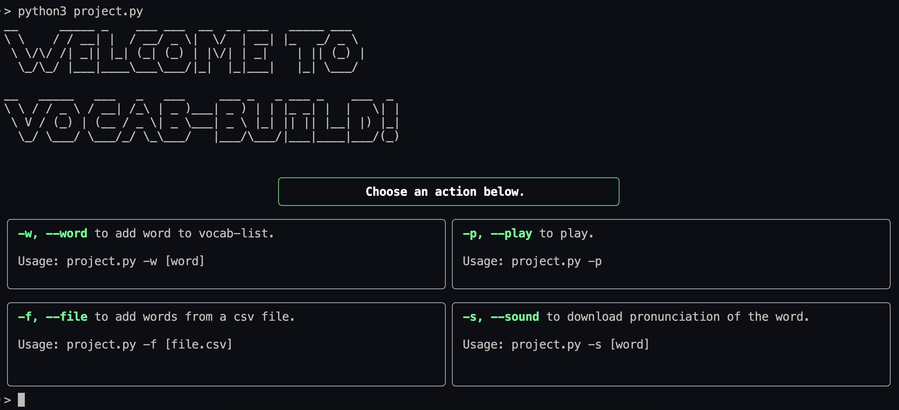
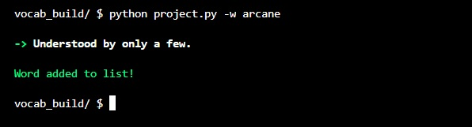

# Vocab-build

Vocab-build is a tool created to study English vocabulary from the command-line.

With it, you can:
- Add a word of your choice
- Download the audio file of the pronunciation of a word
- Add words from another `csv` file (merge files)
- Play and test yourself with a quiz


The project has a `words.csv` file that contains 181 words and definitions, adapted from [sat-words by Scholars' Academy](https://github.com/scholarsnyc/sat-words). All the words you add are appended to this main file.
With the field names `word` and `definition`, the structure of the file simply looks like this:

```
word,definition
arrogate,to take without justification
imperious,"commanding, domineering"
umbrage,"resentment, offense"
cogent,intellectually convincing
...
```

Vocab-build uses the [Rich library](https://github.com/Textualize/rich) to style the display, and format the output on the terminal.

[Free Dictionary API](https://github.com/meetDeveloper/freeDictionaryAPI) is used for finding the definitions of words, as well as for finding the audio URL of a pronunciation.

### Clone the repository:

```
git clone git@github.com:rivea0/vocab-build.git
```

### `cd` into it:

```
cd vocab-build
```

### Create a virtual environment:

```
python -m venv vb-env
```

or:

```
python3 -m venv vb-env
```


### Activate it:

##### Unix/MacOS:

```
source vb-env/bin/activate
```

##### Windows:

```
vb-env\Scripts\activate.bat
```

### Install requirements:
```
python -m pip install -r requirements.txt
```

### The opening screen
If the program is run without any optional arguments (i.e., `python project.py`), the opening screen like the one shown in the image below is displayed:



A "welcome" figlet (created with [pyfiglet](https://pypi.org/project/pyfiglet/)) is shown, followed by a table, informing the user of optional arguments to use to help them choose an action.

### Adding a word
To add a word, the optional argument `--word` or, `-w` is used, followed by a word of choice.

`python project.py -w [WORD]`

[Free Dictionary API](https://github.com/meetDeveloper/freeDictionaryAPI) is used to find the definition of the word. If the operation is successful, the word and its definition are added to the `words.csv` file. The definition is displayed on the terminal as well as a message informing the user that the operation is successful as such:



### Downloading the audio of the pronunciation of a word
To download the audio file of the pronunciation of a word, the optional argument `--sound` or, `-s` is used, followed by a word of choice.

`python project.py -s [WORD]`

Again, the [Free Dictionary API](https://github.com/meetDeveloper/freeDictionaryAPI) is used to find the URL path of the audio file. If it exists, a folder called `sounds` is created on the same path as the program, and a `[WORD].mp3` is created inside it. For example, if the command looks like this for the first time:

`python project.py -s arcane`

Then, the newly created folder structure will simply look like this:

```
sounds/
└── arcane.mp3
```

If the operation is successful, a success message will be displayed on the terminal.

### Adding words from another csv file (merging files)
To add multiple words from another `csv` file, the optional argument `--file` or, `-f` is used, followed by the path of the file to merge.

`python project.py -f [FILENAME].csv`

Note that the file has to have a similar structure to the `words.csv`, except the headers are not necessary.
If the operation is successful, the new words are added to `words.csv`, and a success message is displayed on the terminal.

### Play / quiz
With the option `--play` or, `-p`, the user can play a "quiz game" where they are asked to find the correct definitions of words.

`python project.py -p`

A random word from the `words.csv` file and four definitions (one of them being the correct one, and the rest being randomly chosen) are displayed.

The user enters the number of the definition they choose, and if it is correct, a success message is displayed before continuing to the next question.

If the user gives the wrong answer, an informing message as well as the correct answer is displayed before continuing to the next question.

The game continues until the user chooses to exit the game.

### The file structure
The project consists of four Python files, one of them being the test file, as well as the `words.csv` file for the main vocabulary list, `requirements.txt` for the packages used, and a `README.md` with the folder that has the images used in this file.
- `project.py` is the main file that contains the `main` function itself, it also contains functionality of adding arguments, adding/getting words to/from `words.csv`, and handling the requests for getting definitions and the audio path.
- `style_screen.py` handles the functionality of styling the terminal, such as creating a welcome figlet, creating panels, organizing the layout, and formatting the output.
- `helpers.py` contains some helper functions such as creating the sounds folder and the mp3 file, resolving file path, getting random definitions, and handling user answers related to the "play" option.
- `test_project.py` contains ten tests for all the functions in `project.py` as well as two functions in `style_screen.py`.
- `words.csv` is the main file containing all the words and definitions.

### Requirements
The project requires the following packages:
- pyfiglet==1.0.2
- requests==2.31.0
- rich==12.5.1

For testing:
- pytest==7.2.0

***

Note: This project was initially created as the Final Project for [CS50P](https://cs50.harvard.edu/python/2022/). 

Video demo: https://youtu.be/sdL7JMlujEU